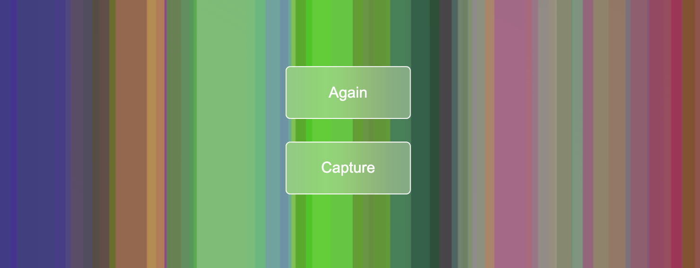

# Canvas Animation with Capture Feature


This web-based application generates a dynamic canvas of colored columns and allows users to genereate, capture, preview, and download screenshots of the animation. The application uses: [➡️ HTML Canvas](https://developer.mozilla.org/en-US/docs/Web/API/Canvas_API) for rendering and [➡️ MediaDevices API](https://developer.mozilla.org/en-US/docs/Web/API/MediaDevices) for the screen capturing feature.

☝️ No external libraries are required; the code uses native JavaScript and browser APIs (Canvas, MediaDevices). ☝️

## Features

✴️ **Dynamic Color Curtain Animation:**

- Renders vertical columns with random positions and RGB colors on an HTML5 Canvas.
- Columns are semi-transparent (25% opacity) and drawn continuously until a maximum of 120 columns is reached.
- Columns are generated at random x-coordinates within the canvas bounds, with a fixed width and full canvas height.
  
✴️ **Capture Feature:**

- Users can capture a screenshot of the entire screen (or monitor) using the browser's MediaDevices API.
- The captured screenshot is displayed in a preview overlay for review.
  
✴️ **Interactive Controls:**

- Capture Button: Initiates the screenshot capture process, temporarily hiding itself and the "Again" button.
- Close Button: Closes the screenshot preview and restores the capture and again buttons.
- Download Button: Allows users to download the captured screenshot as a PNG file, named with a timestamp.

## How It Works

✴️ **Animation:**

- The canvas is initialized with a 2D context and 25% global opacity.
- A `Column` class defines each column's properties (x-position, color, width, height) and a method to draw it.
- The `produceIt` function generates columns with random x-positions and RGB colors, adding them to an array and drawing them on the canvas.
- Animation runs via `requestAnimationFrame` until 120 columns are created, then stops.
  
✴️ **Screenshot Functionality:**

- Clicking the "Capture" button triggers getDisplayMedia to capture the screen.
- A temporary video element streams the capture, and a canvas is used to convert the stream into a PNG data URL.
- The screenshot is displayed in a preview element, and buttons allow the user to close the preview or download the image.
- Errors during capture (e.g., user denies permission) are handled with an alert and console logging.
  
## Installation and Usage

Clone the repository and navigate to it :

   ```bash
   git clone https://github.com/tpreisig/color-curtain.git
   cd color-curtain
   ```

➡️ Load the page in a modern browser supporting the Canvas and MediaDevices APIs.\
➡️ The animation stops after 120 columns to prevent performance issues; modify the counter limit in produceIt to adjust this.\
➡️ Screenshot capture may require user permission, and functionality depends on browser support for getDisplayMedia.\
➡️ The downloaded screenshot filename includes an ISO timestamp for uniqueness.


## License

This project is licensed under the MIT License - see the [LICENSE](LICENSE) file for details.

## Visuals




## Contact

Maintained by tpreisig - feel free to reach out!